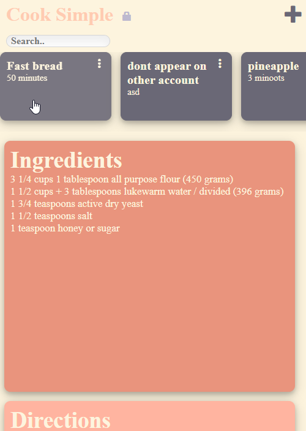
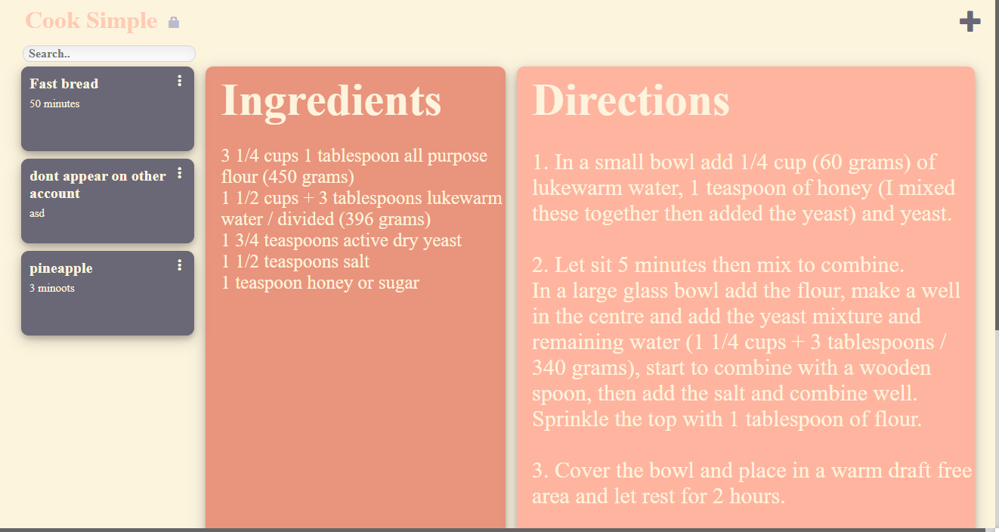

Mobile |  Desktop
:-------------------------:|:-------------------------:
  |  

Application hosted at: https://oqueuo.pythonanywhere.com

<h1>Cook Simple</h1>

If you're tired of finding a recipe online and having to scroll past 6 paragraphs of history before you get to the actual recipe, Cook Simple is perfect for you. Cook Simple is minimalist storage app that let's you create, edit, and share your recipes. To get started, simply make an account and click the "+" on the top right to make a recipe. When you're ready to cook, just pick one of the recipe cards and begin cooking!
